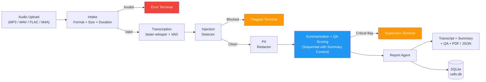
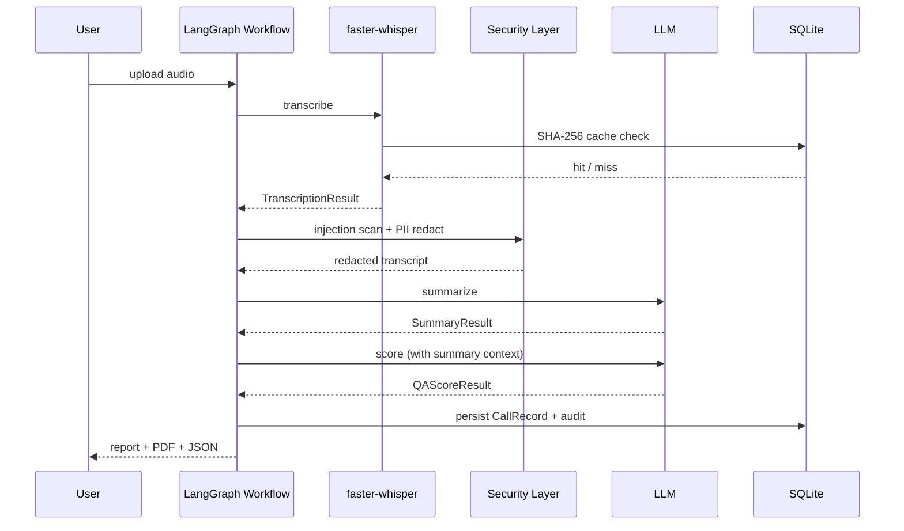

# Call Center Intelligence System

> Turn raw call center audio into structured transcripts, summaries, weighted quality scores, and downloadable PDF / JSON reports in minutes.

[](https://huggingface.co/spaces/animeshkcm/call-center-intelligence)
[](https://github.com/ANI-IN/Call-Center-Intelligence-System)
[](https://www.python.org/downloads/)
[](#tests)
[](./LICENSE)
[](https://github.com/ANI-IN/Call-Center-Intelligence-System/commits/main)

Built on **LangGraph**, **faster-whisper**, **LangChain structured output**, and **Gradio**. Ships with a 3-tab UI, an audit log, transcription caching, a PII redaction and prompt-injection defense layer, and a deterministic weighted QA rubric.

## Table of Contents

1. [The Problem](#the-problem)
2. [The Solution](#the-solution)
3. [Who It Is For and Use Cases](#who-it-is-for-and-use-cases)
4. [Key Features](#key-features)
5. [Demo](#demo)
6. [Architecture](#architecture)
7. [Tech Stack](#tech-stack)
8. [Prerequisites](#prerequisites)
9. [Installation](#installation)
10. [Configuration](#configuration)
11. [Running the App](#running-the-app)
12. [Using the App Step by Step](#using-the-app-step-by-step)
13. [Code Walkthrough](#code-walkthrough)
14. [Sample Data](#sample-data)
15. [Customization](#customization)
16. [Troubleshooting](#troubleshooting)
17. [Project Structure](#project-structure)
18. [Security Notes](#security-notes)
19. [Contributing](#contributing)
20. [License](#license)
21. [Acknowledgments](#acknowledgments)

## The Problem

A mid-sized contact center handles roughly 5,000 calls a day. Manual quality assurance typically reviews fewer than 5% of those calls, with each review taking 10 to 15 minutes of a senior agent's time. The result is three structural failures:

1. **A coverage gap.** Roughly 95% of calls are never reviewed. Coaching, compliance signals, and customer sentiment are invisible at the population level.
2. **A consistency gap.** Inter-rater agreement between human reviewers ranges from 40% to 60% in published QA studies. Two reviewers giving the same call different scores erodes the value of any individual score.
3. **A latency gap.** Reviews happen days after the call. By the time a compliance issue is flagged, the customer has already been impacted.

The cost is real: missed compliance violations, slow coaching feedback, and an inability to spot customer-experience trends until much later.

## The Solution

The Call Center Intelligence System replaces the manual review with an automated pipeline that runs on every call, in minutes, with deterministic scoring rules.

| Pain | Capability |
|---|---|
| Coverage gap | 100% of calls are processed, not a random sample. |
| Consistency gap | A weighted formula (Professionalism 15%, Empathy 20%, Problem Resolution 30%, Compliance 20%, Communication Clarity 15%) is recomputed in Python from the LLM's dimension scores. The overall score never drifts. |
| Latency gap | A 5-minute call finishes processing in 2 to 4 minutes on CPU, or under 30 seconds with a GPU. Compliance flags surface immediately. |
| Cost | About $0.03 per call on GPT-4o; free on Gemini or Groq tier. |
| Trust | PII redacted before any LLM call. 22 prompt-injection patterns are checked at ingestion. Append-only audit log of every action. |

## Who It Is For and Use Cases

### Operations leader at a contact center

You manage 30 to 200 agents across one or more teams. You need population-level visibility into call quality, not anecdotes. You use this system to flag the bottom 10% of calls for human review and to surface week-over-week trends in compliance flags and customer sentiment.

### Compliance officer

You need to know, today, whether any agent disclosed sensitive data without verification or processed a transaction without consent. The compliance scoring dimension and the explicit `compliance_flags` field give you that visibility on every call. Critical flags route to a separate supervisor terminal so they are visible at the top of the queue.

### Applied AI engineer building a similar system

You want a reference implementation of a production multi-agent pipeline that gets the engineering concerns right: typed state, conditional routing, retries, security boundaries enforced inside the graph, multi-provider LLM swap, structured output, deterministic post-processing of LLM outputs, and a clean separation between UI, services, agents, graph, and persistence. The 36-line `app.py` and the 240-line `src/graph/workflow.py` are the entry points.

## Key Features

User-facing:

- 3-tab Gradio UI: Analyze Call, All MP3 History, Observability.
- Upload or microphone-record audio, get a transcript with timestamps, an LLM-generated summary, weighted QA scores, and downloadable PDF and JSON reports.
- Browse every past analysis on the History tab; click a row to load the full transcript and analysis.
- Observability tab shows pipeline metrics, a LangSmith status panel, and the last 20 audit events.

Technical:

- **Multi-agent LangGraph** with 7 nodes and three terminal states (success, supervisor review, error).
- **3 LLM providers** swappable via a single `LLM_PROVIDER` env var: OpenAI GPT-4o (paid), Gemini 2.0 Flash (free), Groq Llama 3.3 70B (free).
- **faster-whisper** with int8 quantization, VAD filter, and greedy decoding for speed.
- **SHA-256 transcription cache** keyed on file content. Identical audio returns instantly.
- **PII redaction** of SSN, credit card, email, and phone in both full text and per-segment text before any LLM call.
- **22 prompt-injection regex patterns** checked at ingestion.
- **Deterministic weighted scoring**: the LLM's `overall_score` is overwritten in Python from the per-dimension scores and fixed weights.
- **Structured LLM output** via `with_structured_output(...)` so the pipeline never tries to parse free-form text.
- **Append-only audit log** with timestamps, actions, and details.

Intentionally not included:

- Real speaker diarization (the heuristic in `src/agents/transcription.py:64-102` is acknowledged as best-effort).
- Multi-tenant authentication (the Gradio UI is single-user; deploy behind an authenticated proxy if you need it).
- Real-time streaming transcription (the pipeline is batch-per-call).
- Voice biometrics or speaker identification.

## Demo

Live: <https://huggingface.co/spaces/animeshkcm/call-center-intelligence>

If a screenshot is not available, the layout looks like this:

```
+-------------------------------------------------------------------------+
| Call Center Intelligence System                                          |
| AI-powered call center analysis platform.                                |
+----[Analyze Call]----[All MP3 History]----[Observability]----------------+
|                                                                          |
|  +-------------------------+   +--------------------------------------+  |
|  |  [ Upload or Record  ]  |   |  Caller ID: [______________]          | |
|  |  [    Audio (mp3)    ]  |   |  Department: [_____________]          | |
|  |                         |   |                                       | |
|  |                         |   |        [   ANALYZE CALL   ]           | |
|  +-------------------------+   +--------------------------------------+  |
|                                                                          |
|  ----------------------------------------------------------------        |
|  > Processing your call... 5 to 10 minutes on the free CPU tier.         |
|  ----------------------------------------------------------------        |
|                                                                          |
|  Full Transcript [v]                                                     |
|  [00:00] Agent: Thank you for calling support, how can I help?           |
|  [00:04] Customer: I have an issue with my last bill.                    |
|  [00:08] Agent: I'm sorry to hear that. Can you describe what you saw?   |
|  ...                                                                     |
|                                                                          |
|  ## Call Summary               | ## Quality Analysis                     |
|  Call Purpose: ...             | Overall Quality Score: 4.10 / 5         |
|  Key Discussion Points:        | Professionalism: 4 / 5                  |
|  - ...                         | Empathy: 4 / 5                          |
|  Action Items:                 | Problem Resolution: 4 / 5               |
|  - Agent: send refund          | Compliance: 4 / 5                       |
|  Resolution: resolved          | Communication Clarity: 4 / 5            |
|  Sentiment: Frustrated -> OK   | Compliance Flags: none.                 |
|                                                                          |
|  [Download Full Report (JSON)]  [Download Full Report (PDF)]             |
+-------------------------------------------------------------------------+
```

## Architecture

See `docs/architecture.md` for the deep version. The TL;DR:



One key call:



## Tech Stack

| Layer | Technology | Reason |
|---|---|---|
| Orchestration | LangGraph | Typed state, conditional edges, named terminals. |
| Speech-to-text | faster-whisper | int8 quantization; 2 to 4x faster than vanilla Whisper. |
| LLM (paid) | OpenAI GPT-4o | Best structured-output quality. |
| LLM (free) | Google Gemini 2.0 Flash | 1,500 requests per day on the free tier. |
| LLM (free) | Groq Llama 3.3 70B | Fastest hosted inference on Llama-class models. |
| LLM framework | LangChain | `with_structured_output` for Pydantic-enforced JSON. |
| Audio metadata | mutagen plus stdlib `wave` | Property extraction for MP3 / FLAC / M4A / WAV. |
| Data models | Pydantic v2 | 14 typed contracts between pipeline stages. |
| Database | SQLite + SQLAlchemy 2.0 | `CallRecord`, `AuditLogEntry`, `TranscriptionCache`. |
| Web UI | Gradio 5.29 | 3 tabs, soft theme. |
| Observability | LangSmith | Per-node tracing via `@traceable`. |
| PDF | ReportLab | PDF report generation. |
| Tests | pytest | 109 unit and security tests; integration suite gated on an LLM key. |
| Lint / format / hooks | ruff + pre-commit + detect-secrets | Fast lint, format, and secret scanning. |

## Prerequisites

- Python 3.11 or later. Tested on 3.11 and 3.12.
- `ffmpeg` available on `PATH`.
- At least one LLM API key.
- About 1 GB of disk for the Python deps; an additional 40 MB to 3 GB for Whisper depending on the model size.

## Installation

### Native (development)

```bash
git clone https://github.com/ANI-IN/Call-Center-Intelligence-System.git
cd Call-Center-Intelligence-System
python -m venv venv && source venv/bin/activate
pip install -e ".[dev]"
pre-commit install
cp .env.example .env
# edit .env to add your LLM key
```

### Docker

```bash
docker build -t call-center-intel .
docker run -p 7860:7860 --env-file .env call-center-intel
```

The `Dockerfile` uses `python:3.12-slim`, installs `ffmpeg`, and runs as a non-root user.

## Configuration

Every knob is an environment variable.

| Variable | Default | Effect |
|---|---|---|
| `LLM_PROVIDER` | `openai` | `openai` / `gemini` / `groq` |
| `OPENAI_API_KEY` / `GOOGLE_API_KEY` / `GROQ_API_KEY` | unset | Per-provider authentication |
| `WHISPER_MODEL_SIZE` | `tiny` | `tiny`, `base`, `small`, `large-v3` |
| `LANGCHAIN_TRACING_V2` | `false` | Enable LangSmith tracing |
| `LANGCHAIN_API_KEY` | unset | LangSmith authentication |
| `LANGCHAIN_PROJECT` | `call-center-intelligence` | LangSmith project name |
| `MAX_RETRIES_PER_NODE` | `3` | LLM retry attempts |
| `LLM_TIMEOUT_SECONDS` | `120` | LLM request timeout |
| `MAX_COST_PER_CALL_USD` | `2.00` | Soft ceiling surfaced in config |
| `CONFIDENCE_THRESHOLD` | `0.3` | Per-segment low-confidence threshold |
| `LOW_CONFIDENCE_HALT_RATIO` | `0.8` | Ratio above which a call is flagged for review |
| `DB_PATH` | `data/calls.db` | SQLite location |
| `DB_ENCRYPTION_KEY` | unset | Optional SQLCipher key |

Knobs that touch behavior directly in code:

| Where to tune | Effect |
|---|---|
| `src/agents/qa_scoring.py:18-24` | Change dimension weights. Must sum to 1.0. |
| `src/agents/qa_scoring.py:26-107` | Rewrite the QA rubric prompt. |
| `src/agents/summarization.py:14-39` | Rewrite the summarization prompt. |
| `src/security/pii_redactor.py:22-31` | Add or remove PII patterns. |
| `src/security/injection_detector.py:6-29` | Add or remove injection patterns. |
| `src/utils/audio.py:13-15` | Change file size limit, duration limit, allowed formats. |

## Running the App

```bash
make run                        # native
docker run -p 7860:7860 --env-file .env call-center-intel
```

The Gradio UI is at <http://127.0.0.1:7860>. On HuggingFace Spaces it binds to 0.0.0.0:7860 automatically because `SPACE_ID` is set.

## Using the App Step by Step

1. Open `http://127.0.0.1:7860` in a browser.
2. **Analyze Call tab**:
   1. Drop an MP3 (or one of the bundled samples) into the audio component.
   2. Optionally fill in Caller ID and Department.
   3. Click **Analyze Call**.
   4. Wait. CPU `tiny` is 2 to 4 minutes for a 5-minute call.
   5. Read the transcript, summary, and QA score. Download PDF or JSON.
3. **All MP3 History tab**: every call you have ever analyzed in this database appears here. Click a row to load the full detail.
4. **Observability tab**: total calls, success rate, average score, total audit events, and LangSmith status.

## Code Walkthrough

The entrypoint is 36 lines:

```python
# app.py:1-36
config = load_config()                                       # 19
_engine = get_engine(str(config.db_path), config.db_encryption_key)  # 21
init_db(_engine)                                             # 22
_get_whisper_model(config.whisper_model_size)                # 25
_workflow = compile_workflow(config, db_engine=_engine)      # 28
_audit = AuditLogger(engine=_engine)                         # 29
demo = build_app(config, _workflow, _engine, _audit)         # 32
demo.launch(server_name=host, server_port=7860, ssr_mode=False)  # 36
```

The workflow definition:

- Nodes: `src/graph/workflow.py:43-187`
- Graph assembly: `src/graph/workflow.py:190-235`
- Routing: `src/graph/edges.py:1-24`

The pipeline orchestration service (UI to graph): `src/services/pipeline.py:49-176`.

The QA scoring weighted recomputation:

```python
# src/agents/qa_scoring.py:18-24, 129-135
DIMENSION_WEIGHTS = {
    "professionalism": 0.15,
    "empathy": 0.20,
    "problem_resolution": 0.30,
    "compliance": 0.20,
    "communication_clarity": 0.15,
}
# overall_score is recomputed deterministically from these weights.
```

For the full map see `docs/architecture.md#what-lives-where`.

## Sample Data

Ten sample MP3s under `data/samples/` exercise different call types:

| File | Scenario | Try asking |
|---|---|---|
| `sample_01.mp3` | Short customer service | Did the agent greet the customer? |
| `sample_02.mp3` | Extended billing inquiry | What action items were captured? |
| `sample_03.mp3` | Technical support | What was the resolution status? |
| `sample_04.mp3` | Account management | Any compliance flags? |
| `sample_05.mp3` | Service complaint | What was the sentiment trajectory? |
| `sample_06.mp3` | Product inquiry | Did empathy score above 3? |
| `sample_07.mp3` | Subscription issue | What entities were extracted? |
| `sample_08.mp3` | Payment dispute | Was a refund discussed? |
| `sample_09.mp3` | Service cancellation | Was the customer retained? |
| `sample_10.mp3` | General inquiry | How clear was the communication? |

## Customization

| You want to ... | Touch |
|---|---|
| Change the QA dimensions or weights | `src/agents/qa_scoring.py:18-24` |
| Rewrite the QA rubric | `src/agents/qa_scoring.py:26-107` |
| Rewrite the summarization prompt | `src/agents/summarization.py:14-39` |
| Add a new LLM provider | `src/utils/llm_factory.py:14-48` |
| Add a new PII pattern | `src/security/pii_redactor.py:22-31` |
| Add a new injection pattern | `src/security/injection_detector.py:6-29` |
| Add a new pipeline node | `src/graph/workflow.py:190-235` |
| Add a new tab | `src/ui/app_builder.py:18-46` and a new file under `src/ui/tabs/` |
| Change the audio size limit | `src/utils/audio.py:13-15` |
| Add a database column | `src/database/models.py:13-45` (plus a migration) |

## Troubleshooting

| Problem | Fix |
|---|---|
| Processing takes more than 10 minutes per call | `WHISPER_MODEL_SIZE=tiny` on CPU, or attach a GPU. |
| `Required environment variable OPENAI_API_KEY is not set` at startup | Set the key in `.env`, or switch `LLM_PROVIDER` to `gemini` / `groq`. |
| `Pipeline failed: Validation failed (no detail captured)` | Verify your file is one of WAV / MP3 / FLAC / M4A. Modern code surfaces specific intake errors at `src/graph/workflow.py:160-176`. |
| `Error in expression` or `ValidationError` from Pydantic | The LLM returned malformed JSON. The retry loop will try again up to `MAX_RETRIES_PER_NODE` times. If it persists, drop to a smaller model or check the provider's status page. |
| `ffmpeg: command not found` | Install ffmpeg: `brew install ffmpeg` (macOS), `apt install ffmpeg` (Debian / Ubuntu). |
| Port 7860 already in use | Set `GRADIO_SERVER_PORT=7861` and re-run. |
| Whisper download is very slow | Hugging Face throttle; retry once. After the first download, the model is cached locally. |
| HuggingFace Space stuck on "Building" | Verify required `Secrets` are set in Space Settings. Build logs reveal the missing variable. |
| Poor transcript quality | Upgrade `WHISPER_MODEL_SIZE` to `small` or `large-v3`. The `tiny` model loses accuracy on noisy or non-English audio. |
| Compliance flags missing on calls that should have them | The injection or PII step may have routed the call away. Check the audit log on the Observability tab. |
| History tab is empty | The DB has no completed calls yet. Analyze one first. |

## Project Structure

See `docs/architecture.md#what-lives-where` for the version with line-range citations. Top-level tree:

```
call-center-intelligence/
├── app.py                              # 36-line entrypoint
├── pyproject.toml                      # deps + tooling
├── requirements.txt                    # pinned deps for HF Spaces
├── Makefile                            # install / test / lint / format / run
├── .env.example                        # env var template
├── README.md                           # this file
├── LICENSE                             # MIT
├── CONTRIBUTING.md                     # contribution guide
├── CODE_OF_CONDUCT.md                  # community norms
├── SECURITY.md                         # private disclosure path
├── CHANGELOG.md                        # Keep-a-Changelog format
├── Dockerfile                          # containerized runs
│
├── src/
│   ├── agents/                         # pipeline stages
│   ├── graph/                          # LangGraph orchestration
│   ├── security/                       # PII + injection + audit
│   ├── services/                       # pipeline / history / observability
│   ├── ui/                             # Gradio presentation layer
│   ├── database/                       # SQLAlchemy models + connection
│   └── utils/                          # shared utilities
│
├── data/samples/                       # 10 bundled MP3s
├── tests/                              # 109 unit + security + 4 integration
└── docs/                               # architecture, getting started
```

## Security Notes

Short version: the system is layered (injection scan, then PII redaction, then LLM, then audit). See `SECURITY.md` for the disclosure path and the known risk areas. Report vulnerabilities privately via GitHub's `Report a vulnerability` button on the Security tab.

## Contributing

See `CONTRIBUTING.md`. The short version: branch from `main`, follow Conventional Commits, run `make test` and `make lint` before pushing, and keep PRs scoped.

## License

MIT. See `LICENSE` for the full notice. The work is provided "AS IS", without warranty of any kind.

## Acknowledgments

- [LangChain and LangGraph](https://www.langchain.com/) for the agent orchestration framework.
- [faster-whisper](https://github.com/SYSTRAN/faster-whisper) and the CTranslate2 backend for the fast on-CPU transcription path.
- [OpenAI](https://openai.com/), [Google AI Studio](https://ai.google.dev/), and [Groq](https://groq.com/) for the language model APIs.
- [Gradio](https://www.gradio.app/) for the UI framework.
- [Hugging Face Spaces](https://huggingface.co/spaces) for free hosting of the live demo.
- The maintainers of `mutagen`, `pydantic`, `sqlalchemy`, `reportlab`, and every other dependency listed in `requirements.txt`.
