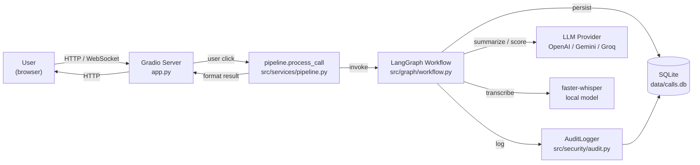
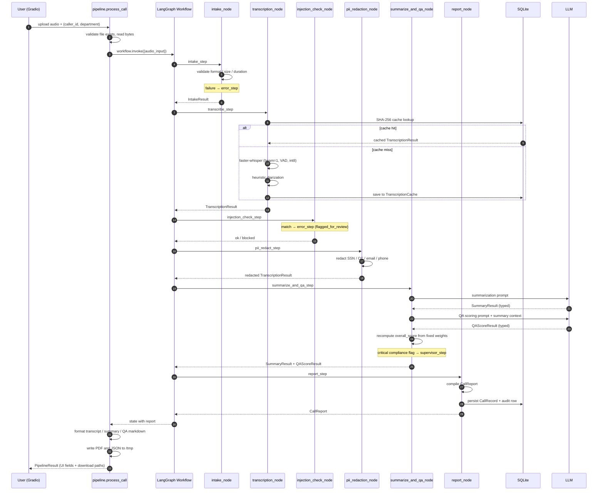
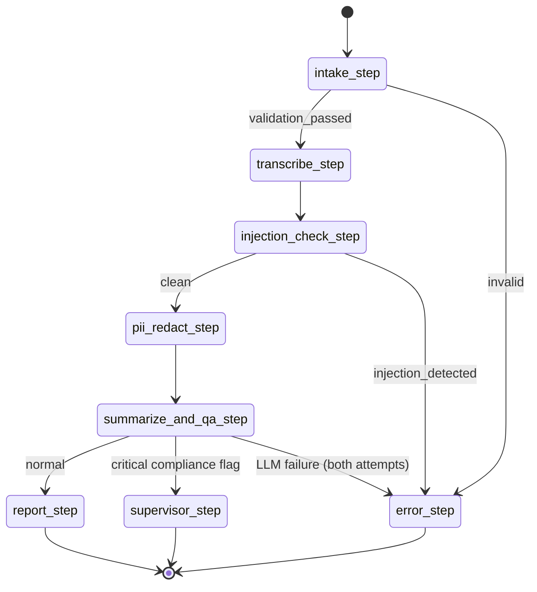
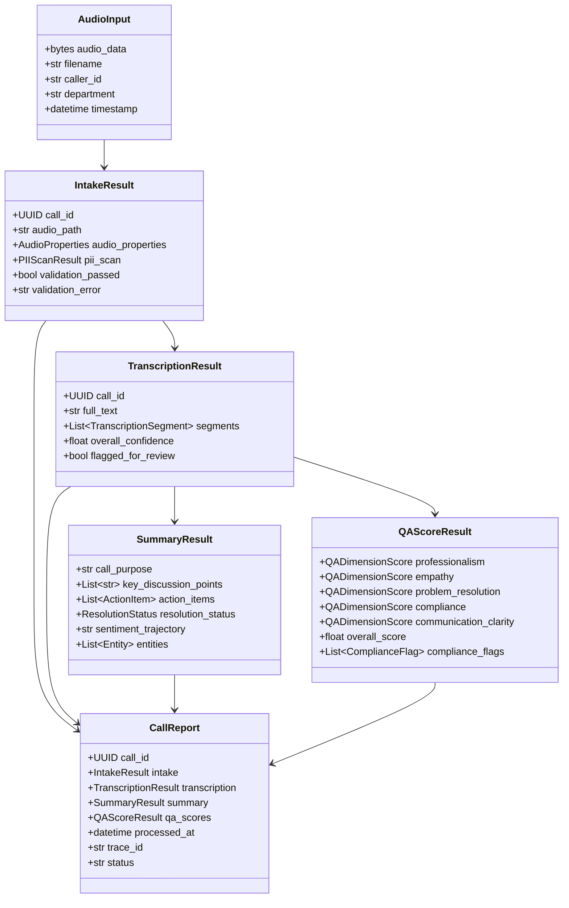
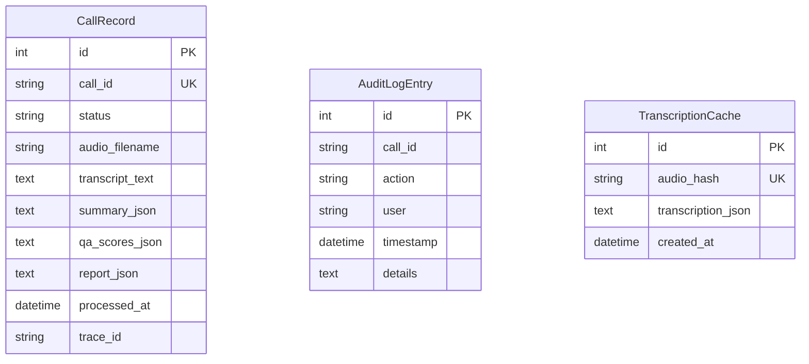

# Architecture

This document is the deep version of the architecture section in `README.md`. It maps every concept the README mentions back to specific file paths and line ranges, calls out trust boundaries and invariants, and provides additional diagrams for the data model and the LangGraph state machine.

If you have read the README, you already know **what** the system does. This document is about **how**, and **where** to find each piece.

## High-Level Component Diagram



**Read this as:** the browser talks to the Gradio server, which calls a thin orchestration service, which invokes the LangGraph workflow. The workflow is the only thing that talks to external services (Whisper locally, the LLM remotely, the database). Every external call is wrapped in a typed Pydantic contract; nothing leaks raw audio bytes or raw transcript text past the security layer.

## What Lives Where

This table maps each architectural concept to the files that implement it, with line ranges accurate as of the audit checkout.

| Concept | File | Lines |
|---|---|---|
| **Entrypoint and bootstrap** | `app.py` | 1-36 |
| **Config (env vars to `Config`)** | `src/utils/config.py` | 1-70 |
| **LLM provider factory** | `src/utils/llm_factory.py` | 1-48 |
| **Audio format detection and validation** | `src/utils/audio.py` | 1-101 |
| **Display formatters (summary, QA, MM:SS)** | `src/utils/formatters.py` | 1-86 |
| **Pydantic state contracts** | `src/graph/state.py` | 1-116 |
| **LangGraph state machine** | `src/graph/workflow.py` | 1-240 |
| **Conditional routing** | `src/graph/edges.py` | 1-24 |
| **Intake agent** | `src/agents/intake.py` | 1-150 |
| **Transcription agent (faster-whisper + diarization + cache)** | `src/agents/transcription.py` | 1-293 |
| **Summarization agent** | `src/agents/summarization.py` | 1-86 |
| **QA scoring agent** | `src/agents/qa_scoring.py` | 1-171 |
| **Report compilation (JSON / PDF / DB)** | `src/agents/report.py` | 1-119 |
| **PII redaction (transcripts)** | `src/security/pii_redactor.py` | 1-72 |
| **Prompt-injection detection** | `src/security/injection_detector.py` | 1-49 |
| **Audit logging** | `src/security/audit.py` | 1-32 |
| **SQLAlchemy ORM models** | `src/database/models.py` | 1-46 |
| **Engine and session management** | `src/database/connection.py` | 1-63 |
| **Pipeline orchestration service** | `src/services/pipeline.py` | 1-177 |
| **History read service** | `src/services/history.py` | 1-117 |
| **Observability metrics service** | `src/services/observability.py` | 1-105 |
| **Gradio app assembly** | `src/ui/app_builder.py` | 1-53 |
| **Analyze Call tab** | `src/ui/tabs/analyze.py` | 1-110 |
| **All MP3 History tab** | `src/ui/tabs/history.py` | 1-195 |
| **Observability tab** | `src/ui/tabs/observability.py` | 1-49 |

## Pipeline Sequence

The full end-to-end sequence for a single call. The graph below is in execution order; the `error` and `supervisor` branches are noted inline.



## LangGraph State Machine



State is a `TypedDict` defined at `src/graph/workflow.py:32-40`. The graph itself is assembled at `src/graph/workflow.py:190-240`. Conditional edge functions live at `src/graph/edges.py:1-24`.

## Data Model



All contracts are defined in `src/graph/state.py:1-116`.

## Persistence Schema

Three SQLAlchemy tables, all defined at `src/database/models.py:1-46`.



- `CallRecord` is the source of truth for the History tab.
- `AuditLogEntry` is append-only by design; the only writer is `AuditLogger.log` at `src/security/audit.py:23-32`.
- `TranscriptionCache` is keyed by SHA-256 of the audio file and grows without bound. A TTL or row cap is recommended for long-running deployments.

## Trust Boundaries

There are four:

1. **Audio bytes from the user.** Handled at `src/services/pipeline.py:49-89`. The file is validated for format (magic bytes), size (50 MB max), and duration (60 minutes max) before reaching any expensive component.
2. **Whisper-produced transcript.** Even though Whisper is local, its output is still untrusted (the audio was untrusted, so the transcript is too). All subsequent code treats it as user input. Injection detection (`src/security/injection_detector.py:39-49`) runs first; PII redaction (`src/security/pii_redactor.py:34-71`) runs second; only then does the redacted text reach any LLM.
3. **LLM-produced JSON.** Structured output via `with_structured_output(SummaryResult)` at `src/agents/summarization.py:63` and `with_structured_output(QAScoreResult)` at `src/agents/qa_scoring.py:147` is parsed by Pydantic. Any drift from the schema raises a validation error which the retry loop at `src/agents/summarization.py:71-83` catches and retries.
4. **Database writes.** Every persistence call goes through `session_scope` at `src/database/connection.py:52-63`, which commits on success and rolls back on any exception.

## Invariants

These are the design assumptions the rest of the code relies on. Violating any of them is a defect.

- **`DIMENSION_WEIGHTS` sums to 1.0.** Declared at `src/agents/qa_scoring.py:18-24`. Used at `src/agents/qa_scoring.py:129-135` to recompute `overall_score`. If the weights drift, the rubric in the README is silently wrong; consider an import-time assertion.
- **Injection check precedes redaction precedes LLM.** Enforced by the graph topology at `src/graph/workflow.py:213-228`. Removing one of those nodes silently routes an unredacted transcript to the LLM.
- **`call_id` is a `uuid.UUID`.** Generated at `src/agents/intake.py:79`. Every downstream model preserves it. Persistence converts to `str(report.call_id)` at `src/agents/report.py:53` because SQLite has no native UUID type.
- **Audio path lifetime.** `IntakeResult.audio_path` is a path to a temp file created at `src/agents/intake.py:135-138`. It is consumed by transcription and then becomes eligible for cleanup. The pipeline appends it to `_temp_files` only if it lives under `/tmp` (`src/services/pipeline.py:165-167`).
- **`overall_score` is recomputed, not trusted from the LLM.** At `src/agents/qa_scoring.py:160`. The LLM's emitted `overall_score` is overwritten with the weighted sum.

## Configuration Surface

Defined at `src/utils/config.py:1-70` and documented at `README.md:432-449` plus `.env.example:1-31`. The runtime reads only environment variables; there is no config file.

| Variable | Where it lands | Effect |
|---|---|---|
| `LLM_PROVIDER` | `Config.llm_provider` | Switch between OpenAI, Gemini, Groq. |
| `OPENAI_API_KEY` / `GOOGLE_API_KEY` / `GROQ_API_KEY` | Read at LLM-call time by `langchain-*` packages | Authentication to the chosen provider. |
| `WHISPER_MODEL_SIZE` | `_get_whisper_model` | Tiny / base / small / large-v3. |
| `CONFIDENCE_THRESHOLD` | `transcription_node` | Per-segment threshold for `low_confidence`. |
| `LOW_CONFIDENCE_HALT_RATIO` | `transcription_node` | Ratio above which the call is `flagged_for_review`. |
| `MAX_RETRIES_PER_NODE` | `summarize_and_qa_node` | Retry count for LLM calls. |
| `LLM_TIMEOUT_SECONDS` | LangChain LLM clients | Per-call timeout. |
| `DB_PATH` | `get_engine` | SQLite file location. |
| `DB_ENCRYPTION_KEY` | `get_engine` | SQLCipher key (only honored if SQLCipher is available). |
| `LANGCHAIN_TRACING_V2` | LangSmith decorators | Enable per-node tracing. |
| `LANGCHAIN_PROJECT` | LangSmith decorators | Project name in LangSmith. |
| `LANGCHAIN_API_KEY` | LangSmith client | LangSmith authentication. |
| `SPACE_ID` (HF) | `app.py:35` | Switches host binding from `127.0.0.1` to `0.0.0.0`. |

## Performance Profile

A 5-minute call on a CPU-only HuggingFace Space with `WHISPER_MODEL_SIZE=tiny`:

- Intake: under 100 ms.
- Transcription: 60-180 seconds (first time), under 100 ms (cache hit).
- Injection scan + PII redaction: under 100 ms combined.
- Summarization: 5-15 seconds (OpenAI), 5-10 seconds (Groq), 10-20 seconds (Gemini).
- QA scoring: 5-15 seconds.
- Report compile, PDF, persist, audit: under 1 second total.

The transcription cache shortcuts the longest stage when identical audio is uploaded again. A TTL or row cap on the cache is recommended for long-running deployments.

## Development Workflow

The Makefile at `Makefile:1-38` exposes the canonical commands. The two you will use most:

```bash
make test        # 109 unit + security tests, under 20 seconds
make lint        # ruff check + format --check
```

For full guidance see `CONTRIBUTING.md` at the repo root.
